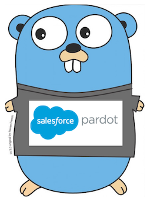

# ParGo [](https://gitlab.xyz.apnic.net/go-pkg/pardot/commits/master) [](https://gitlab.xyz.apnic.net/go-pkg/pardot/commits/master)

Package pargo provides a Go client for the [Pardot REST API](http://developer.pardot.com).

`go get gitlab.xyz.apnic.net/go-pkg/pargo`



```go
type prospect struct {
    ID    int    `json:"id"`
    Email string `json:"email"`
}
response := []prospect{} // Placeholder for the response.
pardot := pargo.NewPargo(
    pargo.UserAccount{
        Email:   "my@email.com",
        Pass:    "mypass",
        UserKey: "myclientkey",
    })
err := pardot.Call(pargo.QueryProspects{
    Offset:      0,
    Limit:       200,
    Fields:      []string{"id", "email"},
    PlaceHolder: &response, // Pointer to placeholder.
})
if err != nil {
    // Handle error, optionally testing for custom ParGo errors:
    switch err.(type) {
    case pargo.ErrLoginFailed:
        // Invalid credentials.
    case pargo.ErrInvalidJSON:
        // Invalid request.
	default:
		// Some other error.
	}
}
// ... Use `response` slice.
```
